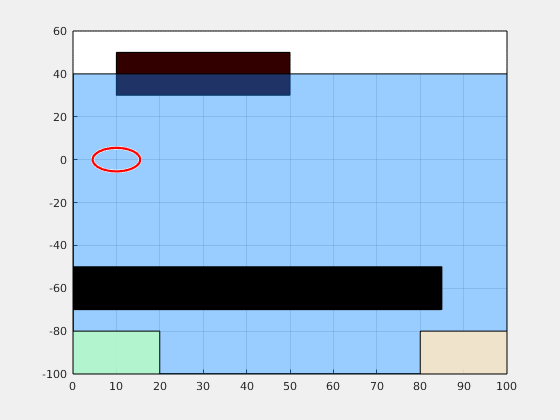
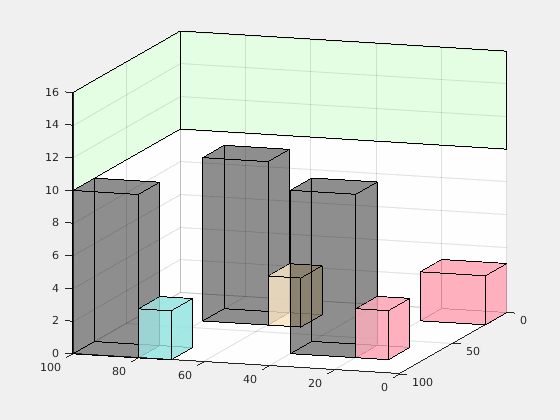

<!-- ABOUT THE PROJECT -->
## About The Project

This repository implements [Gaussian Belief Trees (GBT)](https://arxiv.org/abs/2202.12407) and [Simplified Models with Belief Approximation (SiMBA)](https://arxiv.org/abs/2210.10202) for motion planning under motion and measurement noise to satisfy reach-avoid and Linear Temporal Logic over finite traces (LTLf) specifications.


<!-- GETTING STARTED -->
## Getting Started

To get a local copy up and running follow these simple example steps.

### Prerequisites

* [Open Motion Planning Library](https://ompl.kavrakilab.org/installation.html)
* [Spot](https://spot.lre.epita.fr/)
* [ROS2](https://docs.ros.org/en/iron/index.html)

### Installation

1. Clone the repository
   ```sh
   git clone https://github.com/your_username_/Project-Name.git
   ```

2. You can also use a docker container.


```
cd build

cmake .

make
```

## Usage

### Setting up environment

Change the yaml file in configurations/scenes:


Define obstacles and propositions as a set of polygons.

```
scene:

  bounds:
    - [0, 100]
    - [0, 100]

  obstacles:

    - fx: 0
      tx: 43
      fy: 50
      ty: 80
      fz: 0
      tz: 10

    - fx: 50
      tx: 100
      fy: 50
      ty: 80
      fz: 0
      tz: 10

  Propositions:
    
    - fx: 90
      tx: 10
      fy: 90
      ty: 10
      fz: 0
      tz: 100

```

### Setting up system and planner

Update the yaml file in configurations/systems:

```
system:

  system:
    A : 
      - [1,0,0,0]
      - [0,1,0,0]
      - [0,0,1,0]
      - [0,0,0,1]
    B : 
      - [1,0,0,0] 
      - [0,1,0,0]
      - [0,0,1,0]
      - [0,0,0,1]
    C : 
      - [1,0,0,0]
      - [0,1,0,0]
      - [0,0,1,0]
      - [0,0,0,1]
    Q : 0.2
    R : 0.1

  planner:
    planning_time: 60.0
    p_safe: 0.95
    goal_radius: 10
    cost_threshold: 45.0
    pruning_radius: 1
    selection_radius: 5
    sampling_bias: 0.2
    goal_bias: 0.05
    propagation_size: 0.1
    starting_configuration: [90, 1]
    surge_bounds: [0, 0.5]
    control_duration: [1,20]
    control_bounds:
      - [-20, 20]
      - [-20, 20]
      - [0, 1]
```

### Define task specification

Update yaml file in configurations/systems/specifications:

```
  specification:
    spec: "reach-avoid" #can be "reach-avoid", "ltlf"
    goal_configuration: [90, 90]
    formula: ""
```

### Run motion planner

```./main```

## Visualization

# Running the Visualization with RViz and ROS2

Follow these steps to set up and run your visualization using RViz in ROS2.

### **Step 1: Publish a Static Transform**

First, we need to publish a static transform between the `world` and `map` frames. Open a new terminal window and enter the following command:

```bash
ros2 run tf2_ros static_transform_publisher 0 0 0 0 0 0 1 world map
```

This command publishes a static transform with no translation or rotation between the `world` and `map` frames.

### **Step 2: Build the Workspace and Run the Visualizer**

Next, we'll build the ROS workspace and run the visualizer node.

1. Open a **new terminal window**.
2. Navigate to the `GaussianBeliefTrees/ros_ws` directory:

    ```bash
    colcon build
    source /opt/ros/foxy/setup.bash
    source ~/dev/research/GaussianBeliefTrees/ros_ws/install/setup.bash
    ros2 run agent_visualizer timer_callback
    ```

### **Step 3: Launch RViz**

Finally, open a new terminal and launch RViz:

```bash
ros2 run rviz2 rviz2
```

In RViz:
- Click `Add` in the bottom left.
- Add a MarkerArray and change the topic to `visualization_marker_array/obstacles`.
- Add another MarkerArray and change the topic to `visualization_marker_array/agent`.


# Example Motion Plans

## Reach-avoid spec

"Go to green region while avoiding black obstacles"



## LTLf formula

"Avoid gray buildings. Go to blue region to pick up a package, followed by yellow region to drop package. After going to blue region, do not fly higher than gray buildings"




<!-- ROADMAP -->
## Roadmap

The following will be included as core functionality by 1st May.

- [ ] Full LTLf planner support - current planner has full support for reach-avoid specifications with the GBT algorithm. LTLf specifications with the SiMBA algorithm are partially tested and its generality is a work in progress.
- [ ] Full ROS support - current ROS support is mainly for visualization of computed plans. We plan to create a plugin as a global planner in ROS 2.
- [ ] Update documentation


<!-- LICENSE -->
## License

Distributed under the MIT License.

## Citing this work

If you find this repository useful, please consider citing:

- Qi Heng Ho, Zachary N. Sunberg, and Morteza Lahijanian, [Gaussian Belief Trees for Chance Constrained Asymptotically Optimal Motion Planning](https://ieeexplore.ieee.org/document/9812343) 2022 International Conference on Robotics and Automation (ICRA), pp. 11029-11035.

for reach-avoid specifications, or

- Qi Heng Ho, Zachary N. Sunberg, and Morteza Lahijanian, [Planning with SiMBA: Motion Planning under Uncertainty for Temporal Goals using Simplified Belief Guides](https://ieeexplore.ieee.org/abstract/document/10160897) 2023 International Conference on Robotics and Automation (ICRA), pp. 5723-5729

for general LTLf specifications.

<!-- CONTACT -->
## Contact

[Qi Heng Ho](qi.ho@colorado.edu)